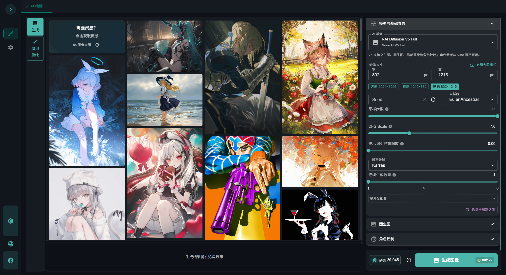
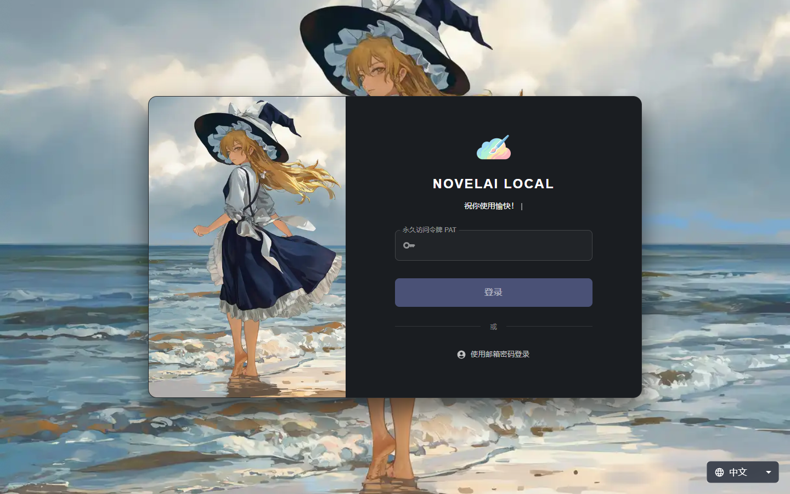
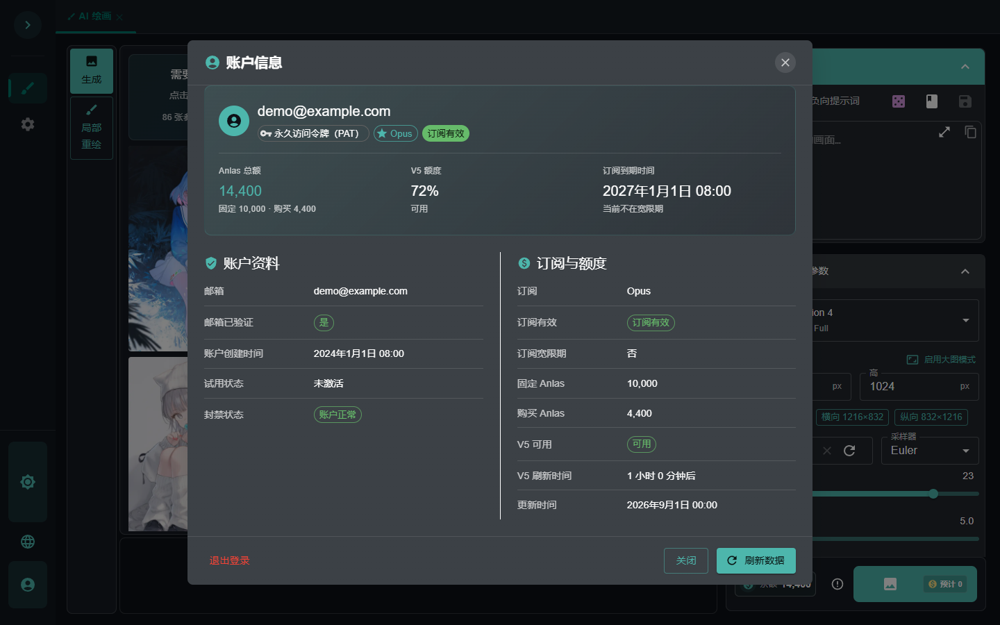
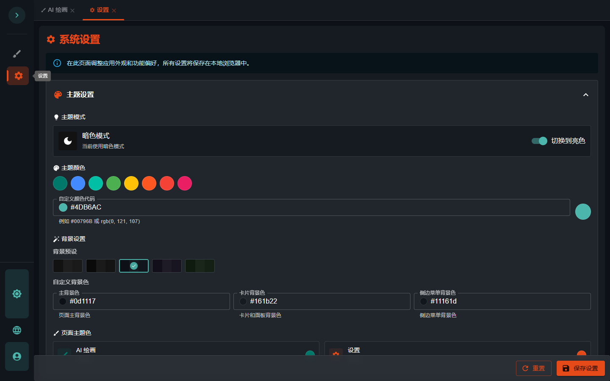

<p align="center">
  
</p>

<h1 align="center">NovelAI Local Web</h1>

<p align="center">
  面向个人桌面使用的 NovelAI 图像生成工作台
</p>

<p align="center">
  
  
  
  
</p>

<p align="center">
  <a href="https://nai.idlecloud.cc">在线网站</a> ·
  <a href="#项目简介">项目简介</a> ·
  <a href="#页面预览">页面预览</a> ·
  <a href="#功能概览">功能概览</a> ·
  <a href="#快速部署">快速部署</a> ·
  <a href="#使用说明">使用说明</a> ·
  <a href="#开发与测试">开发与测试</a>
</p>

## 在线网站

在线生成体验：[IDLECLOUD AI WEB](https://nai.idlecloud.cc)

## 项目简介

NovelAI Local Web 是一个在 Windows 本机运行的 NovelAI 图像生成 Web 客户端。它将提示词编写、模型参数、角色控制、参考图工具、生成预览、账户额度和本地内容管理集中在同一个响应式界面中，适合个人日常创作与参数整理。

浏览器页面由 Next.js 构建，Flask/Waitress 在本机同源提供静态页面和 `/api`。服务默认只监听 `127.0.0.1:5000`，图像与账户请求直接发送至 NovelAI 官方 `https://image.novelai.net`，设置、提示词笔记和随机提示词以本地 JSON 保存。

```text
浏览器（Next.js 静态页面）
            │
            │  http://127.0.0.1:5000
            ▼
Flask / Waitress ───────────────► NovelAI 官方图像 API
       │
       └────────────────────────► 本地 JSON 工作区
```

> [!IMPORTANT]
> 本项目定位为本机单用户工具，只支持 loopback 访问。请勿将服务直接绑定到局域网或公网地址。

## 页面预览

截图中的邮箱、订阅和额度均为演示数据，不对应任何真实账户。

### 创作工作台

提示词、灵感画廊、模型参数、生成预览、余额与预计消耗在一个页面内完成。



<table>
  <tr>
    <td width="50%" align="center"><strong>登录页面</strong></td>
    <td width="50%" align="center"><strong>账户信息</strong></td>
  </tr>
  <tr>
    <td></td>
    <td></td>
  </tr>
  <tr>
    <td>支持 Persistent Token 与邮箱密码两种登录方式。</td>
    <td>集中展示账户状态、订阅、Anlas 余额和 V5 额度。</td>
  </tr>
</table>

### 个性化设置

支持亮色/暗色主题、主题色、背景、页面配色、动画、自动下载和文件命名设置。



## 功能概览

| 模块 | 能力 |
| --- | --- |
| 图像生成 | 文生图、图生图、局部重绘、单张生成和 1–8 张连续生成 |
| 模型 | NAI Diffusion V3、Furry V3、V4 Full/Curated、V4.5 Full/Curated、V5 Full/Curated |
| 提示词 | 正向/负向提示词、V4/V5 Tokenizer、官方标签建议、随机提示词、提示词笔记 |
| 角色与参考 | 角色提示词、角色坐标、Vibe Transfer、Director Reference 与 Director Tools |
| 图像工具 | NovelAI 官方 Upscale、Augment、PNG 元数据读取与参数回填 |
| 结果管理 | 即时预览、单图下载、自动下载、文件命名和当前页面生成画廊 |
| 灵感画廊 | 内置 86 张参考图，可直接将示例参数应用到创作工作台 |
| 账户与额度 | 官方账户资料、订阅状态、到期时间、固定/购买/总 Anlas、V5 额度 |
| 本地内容 | 提示词笔记、随机提示词、界面偏好及 JSON 导入/导出 |
| 界面 | 中文/英文、亮色/暗色、主题色与背景、桌面和移动端响应式布局 |

不同模型支持的参数并不完全相同。界面会根据当前模型启用可用控件，后端也会再次校验请求，避免把不受支持的 Vibe、角色参考或 Director 参数静默发送给官方接口。

## 系统要求

| 项目 | 最低要求 | 说明 |
| --- | --- | --- |
| 操作系统 | Windows 10 / 11 | 启动与安装脚本为 `.bat` 和 PowerShell |
| Python | 3.11 或更高版本 | 需要可用的 Windows `py` Launcher |
| Node.js | 20 或更高版本 | 需要同时提供 `node` 与 `npm` |
| 浏览器 | Edge、Chrome、Firefox 等现代浏览器 | 启动后会自动打开默认浏览器 |
| 网络 | 可访问 `https://image.novelai.net` | 登录、账户查询和图像生成均使用官方服务 |
| NovelAI 账户 | Persistent Token 或邮箱密码 | 图像使用权限与扣费规则以官方账户状态为准 |

## 快速部署

### 1. 获取项目

下载源码压缩包并解压，或使用 Git 克隆仓库。进入包含下列文件的项目根目录：

```text
novelai_local_web/
├─ setup.bat
├─ start.bat
├─ nai_flask/
└─ next_nai_web/
```

### 2. 首次安装

双击根目录的 `setup.bat`。

安装脚本会依次：

1. 检查 Python 3.11+ 与 Node.js 20+；
2. 在 `nai_flask/.venv` 创建 Python 虚拟环境；
3. 安装 Flask 后端依赖；
4. 使用 `npm ci` 安装前端依赖；
5. 构建 Next.js 静态页面到 `next_nai_web/out`。

也可以在 PowerShell 中运行：

```powershell
cd E:\path\to\novelai_local_web
.\setup.bat
```

首次安装需要下载依赖，耗时取决于网络和磁盘速度。出现“安装完成”后即可启动。

### 3. 启动应用

双击根目录的 `start.bat`，或在 PowerShell 中执行：

```powershell
.\start.bat
```

服务就绪后会自动打开：

<http://127.0.0.1:5000/login>

请保持启动窗口开启。按 `Ctrl+C` 或关闭该窗口即可停止服务。

启动器会先检查目标端口：

- 如果端口空闲，启动当前项目；
- 如果当前项目已经健康运行，直接复用现有服务并打开浏览器；
- 如果端口被其他程序占用，明确报错并停止，不会自动切换到其他端口。

### 4. 更新项目

拉取或覆盖新版本源码后，再次运行 `setup.bat`。脚本会更新依赖并重新生成前端静态产物，然后使用 `start.bat` 启动。

## 本地配置

默认配置可以直接使用。如需修改端口、数据目录或官方请求超时，将示例文件复制为本地配置：

```powershell
Copy-Item .\nai_flask\config.example.json .\nai_flask\config.local.json
```

`nai_flask/config.local.json`：

```json
{
  "port": 5000,
  "data_dir": "data",
  "upstream_timeout_seconds": 120
}
```

| 配置项 | 默认值 | 说明 |
| --- | ---: | --- |
| `port` | `5000` | 本机 loopback 端口，允许范围为 `1`–`65535` |
| `data_dir` | `data` | 本地数据目录；相对路径以 `nai_flask` 为基准，也可填写绝对路径 |
| `upstream_timeout_seconds` | `120` | 单次 NovelAI 官方请求的读取超时秒数 |

Windows JSON 中建议使用正斜杠表示绝对路径，例如 `E:/NovelAIData`。配置修改后需要重启后端。未知配置项、无效端口或无法解析的 JSON 会使服务拒绝启动并显示错误。

> [!WARNING]
> `config.local.json` 只用于运行参数。不要在其中写入 Persistent Token、邮箱、密码或其他账户凭据。

## 使用说明

### 登录

登录页提供两种方式：

- **Persistent Token**：默认入口，适合日常使用。粘贴 NovelAI 官方 Persistent Token 后登录。
- **邮箱密码**：输入 NovelAI 官方账户邮箱和密码。密码只在本机后端内存中用于派生 Access Key，原始密码不会发送给 NovelAI 官方接口，也不会保存到磁盘。

如果官方接口要求额外验证码，邮箱密码登录会返回 `OFFICIAL_CAPTCHA_REQUIRED` 并提示改用 Persistent Token，本项目不会尝试绕过官方验证。

### 创建图像

1. 在正向提示词中描述画面，并按需填写负向提示词；
2. 选择模型、画布尺寸、采样器、步数、CFG Scale 和 Seed；
3. 按需展开图生图、局部重绘、角色控制、Vibe 或 Director 工具；
4. 在生成栏确认 Anlas 余额、图像数量和预计消耗；
5. 点击生成，完成的图片会立即加入当前页面画廊；
6. 使用下载按钮保存图片，或在设置页启用自动下载。

生成栏中的预计消耗用于创作前参考，最终扣费和订阅免费规则以 NovelAI 官方返回为准。

### 连续生成

一次点击可连续生成 `1`–`8` 张图片。每次官方请求固定生成一张，单张成功后立即显示；还有后续任务时，应用等待 15 秒再发送下一次请求。

- 最后一张完成后不会额外等待；
- 页面关闭或刷新后不会在后台继续；
- 取消只会阻止尚未发送的请求；
- 遇到限流、超时、断连、官方 5xx、响应损坏或结果不确定时，整批立即停止；
- 不会自动重试，已经成功的图片仍保留在当前页面。

请根据自己的账户权限使用连续生成，并遵守 [NovelAI 服务条款](https://novelai.net/terms)。

### 提示词与灵感

- **提示词编辑器**：分别编辑正向和负向提示词，查看 V4/V5 Tokenizer 结果并请求官方标签建议；
- **随机提示词**：按分类和集合维护词条，支持随机或顺序模式；
- **提示词笔记**：保存标题、提示词、角色、参数和可选缩略图，支持 JSON 导入/导出；
- **灵感画廊**：浏览 86 张参考图，点击后将示例参数应用到当前创作页面；
- **PNG 参数回填**：读取 NovelAI PNG 元数据，并将可识别参数带回编辑器。

### 账户与额度

账户页面会显示：

- 登录方式和凭据管理权限；
- 邮箱及验证状态、账户创建时间、试用和封禁状态；
- 订阅等级、有效状态、宽限期和到期时间；
- 固定 Anlas、购买 Anlas 与总 Anlas；
- V5 百分比、可用状态和下一次更新时间。

余额也会显示在桌面生成栏和移动端操作区域。登录、生成、图像工具操作、账户变更或手动刷新后会更新账户快照；刷新失败时保留上一次数据并标记为过期，避免把缺失字段显示成错误的 `0`。

通过邮箱密码登录的会话可以在账户页修改密码或邮箱。每次操作都需要重新输入当前密码。

> [!CAUTION]
> 修改密码或邮箱前，请先在 NovelAI 官方页面备份重要远程内容。凭据变更依赖官方当前接口和 keystore 格式；遇到超时或结果不确定时不会自动重试。

### 设置

设置页包含：

- 中文与英文界面；
- 亮色/暗色主题；
- 主题色、背景预设与自定义页面配色；
- 页面动画开关；
- 自动下载；
- 文件名格式与命名规则。

首次使用默认显示英文。手动切换为中文后，语言选择会在本地持久保存。

## 本地数据与隐私

默认数据目录为 `nai_flask/data`。不同官方账户共享同一个本地个人工作区，退出或换号不会删除提示词笔记和界面设置。

| 文件或存储 | 内容 |
| --- | --- |
| `settings.json` | 本地应用设置 |
| `random-prompts.json` | 随机提示词分类、集合、启用状态与模式 |
| `notes.json` | 提示词笔记、参数和可选缩略图 |
| `account-change-recovery.json` | 未完成凭据变更的非敏感恢复阶段信息，仅在需要时出现 |
| 浏览器 localStorage | 提示词草稿和部分界面偏好 |
| 浏览器 IndexedDB | Vibe 派生缓存 |

本地 JSON 使用 schema 校验、独立锁、同目录临时文件、原子替换和 last-good 备份。单个文件默认限制为 10 MiB；文件损坏时会明确报错，不会静默重置。

生成图片不会建立服务器端历史仓库，只保留在当前浏览器页面中。刷新或关闭页面前，请手动下载需要的图片，或启用自动下载。备份个人工作区时，请先停止服务，再复制完整的数据目录。

### 凭据处理

- Persistent Token、JWT、密码、Access Key 和 Encryption Key 仅存在于后端进程内存；
- 浏览器 Cookie 只保存随机会话 ID，并启用 `HttpOnly` 与 `SameSite=Strict`；
- 退出登录、浏览器会话结束、服务重启或官方返回 401 后，本地会话失效；
- 本地接口校验 `Host`、`Origin` 和 CSRF Token；
- 携带 Authorization 的官方请求不跟随跨主机重定向；
- 日志不记录 Authorization、Token、密码、Cookie、请求正文、官方响应正文或图片 Base64。

请不要把凭据写入源码、配置文件、截图、Issue 或终端历史。如果凭据意外泄露，请立即通过 NovelAI 官方渠道轮换。

## 运行日志与问题排查

`start.bat` 窗口会输出结构化运行日志，包括：

- 本地 API 请求方法、路由、状态码、耗时和 correlation ID；
- 官方操作类型、目标主机、状态码和稳定错误码；
- 生成批次进度、余额刷新和账户操作结果。

默认日志级别为 `INFO`。需要临时查看更详细日志时，在同一个 PowerShell 窗口执行：

```powershell
$env:NOVELAI_LOCAL_LOG_LEVEL = 'DEBUG'
.\start.bat
```

调试完成后关闭该窗口即可清除临时环境变量。反馈问题时可提供错误时间、稳定错误码和 correlation ID，但不要提供 Token、密码或完整账户响应。

| 问题 | 处理方式 |
| --- | --- |
| 提示未找到 Python Launcher | 安装 Python 3.11+，并确认终端可运行 `py -3 --version` |
| 提示未找到 Node.js 或 npm | 安装 Node.js 20+，并确认 `node --version`、`npm --version` 可用 |
| `setup.bat` 构建失败 | 保留窗口中的首个错误，检查网络后重新运行；不要只根据最后一行判断原因 |
| 端口 5000 被占用 | 关闭占用端口的旧程序，或在 `config.local.json` 中明确设置其他空闲端口 |
| 修改前端后页面没有变化 | 重新运行 `setup.bat` 或在 `next_nai_web` 执行 `npm run build`，再重启服务 |
| Persistent Token 登录返回 401 | 检查 Token 是否完整、有效并属于当前官方账户，必要时在官方页面轮换 |
| 邮箱密码登录要求验证码 | 改用 Persistent Token 登录 |
| 生成返回 400 | 检查当前模型与 Vibe、参考图、角色等参数是否兼容，可先恢复默认参数再逐项添加 |
| 账户数据标记为过期 | 检查网络和官方服务状态，然后在账户页手动刷新 |
| 本地 JSON 损坏 | 根据错误中给出的文件检查同目录 `.bak`，修复前先保留损坏文件和备份副本 |

查看本机端口占用：

```powershell
Get-NetTCPConnection -State Listen -LocalPort 5000
```

## 项目结构

```text
novelai_local_web/
├─ .github/workflows/       # 自动化测试与构建
├─ docs/screenshots/        # README 页面截图
├─ nai_flask/               # Flask API、官方客户端、本地数据与后端测试
│  ├─ api_utils/
│  ├─ tests/
│  ├─ config.example.json
│  └─ requirements.txt
├─ next_nai_web/            # Next.js / React 前端
│  ├─ public/
│  ├─ src/
│  └─ package.json
├─ scripts/                 # 本地启动与发布检查脚本
├─ setup.bat                # 首次安装与重新构建
├─ start.bat                # 双击启动入口
├─ LICENSE
└─ README.md
```

## 本地 API 概览

这些接口服务于同源前端，不是面向公网开放的远程 API。

| 分组 | 接口 |
| --- | --- |
| 会话 | `GET /api/session`、`POST /api/session/persistent-token`、`POST /api/session/password`、`DELETE /api/session` |
| 账户 | `GET /api/account`、凭据变更与恢复接口 |
| 图像 | `POST /api/images/generate`、批次取消、Vibe、Upscale、Augment、标签建议 |
| 本地内容 | 设置、随机提示词和提示词笔记的读取、保存、删除与导入/导出 |

错误响应使用稳定错误码、安全消息、结果确定性和 correlation ID，不会把官方响应正文或 Authorization 返回给浏览器。

## 开发与测试

先运行一次 `setup.bat` 准备 Python 虚拟环境和前端依赖。

### 后端测试

```powershell
cd nai_flask
.\.venv\Scripts\python.exe -m pytest
```

### 前端测试、Lint 与生产构建

```powershell
cd next_nai_web
npm test
npm run lint
npm run build
```

### 发布边界检查

在项目根目录执行：

```powershell
.\nai_flask\.venv\Scripts\python.exe .\scripts\verify_release.py
```

自动化测试使用模拟官方接口，不需要 NovelAI 凭据。

## 许可证

本项目使用 [GNU Affero General Public License v3.0](./LICENSE) 发布。

## 免责声明

NovelAI Local Web 是非官方社区项目，与 NovelAI 或 Anlatan 不存在隶属、授权或背书关系。使用者需要自行准备合法的 NovelAI 账户，并对账户安全、生成内容、费用和对官方服务条款的遵守负责。
