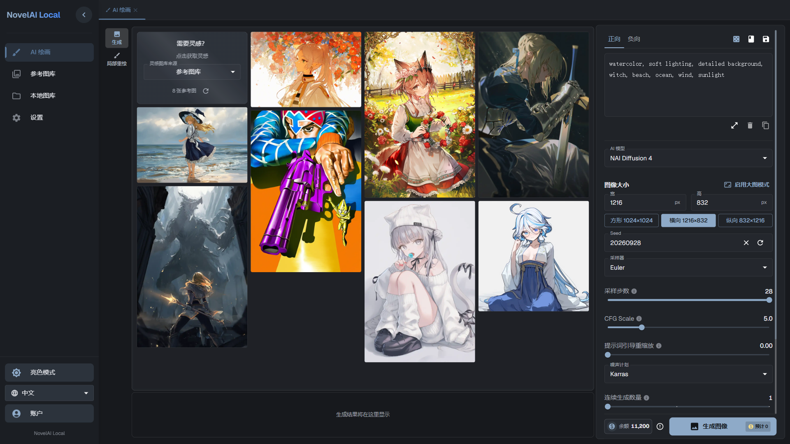
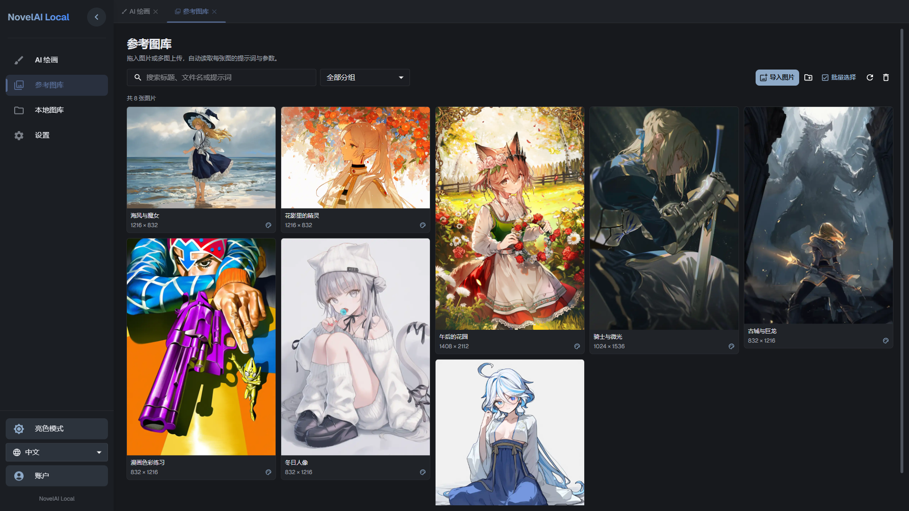
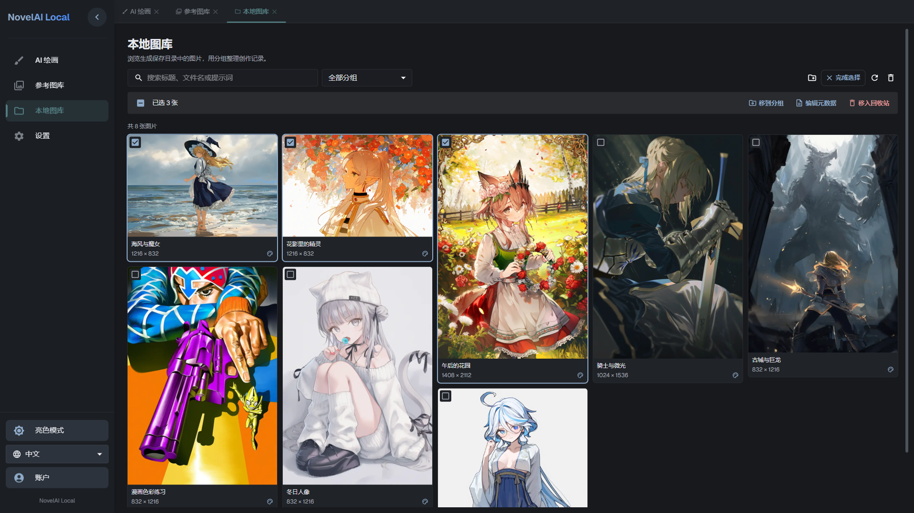
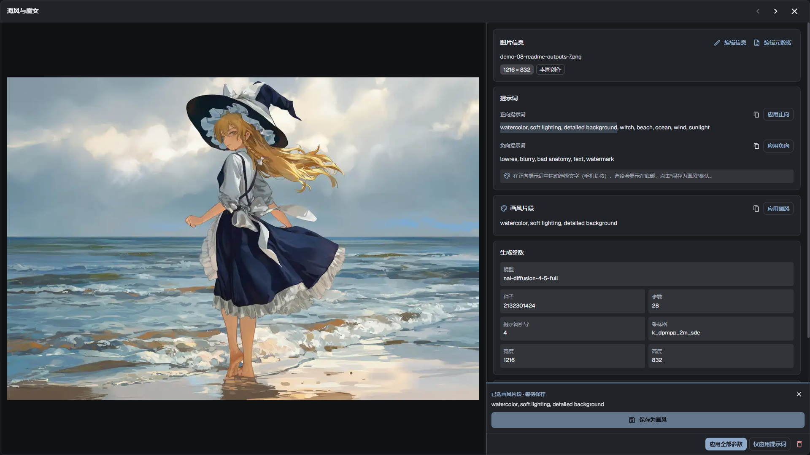
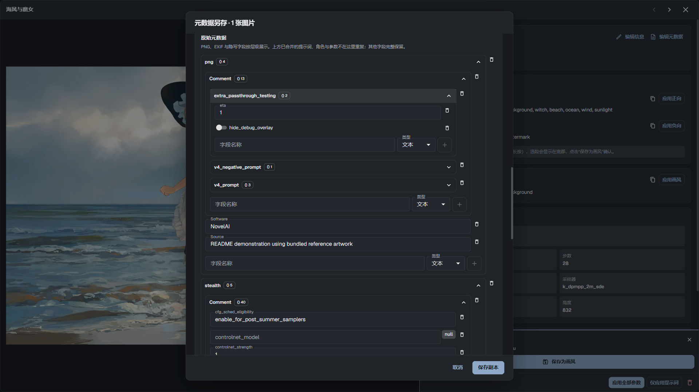
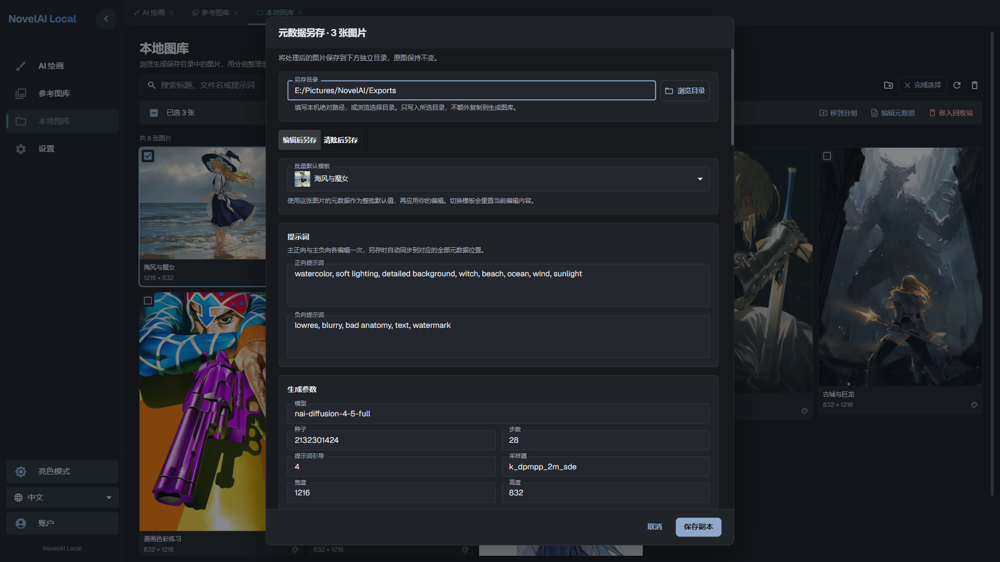
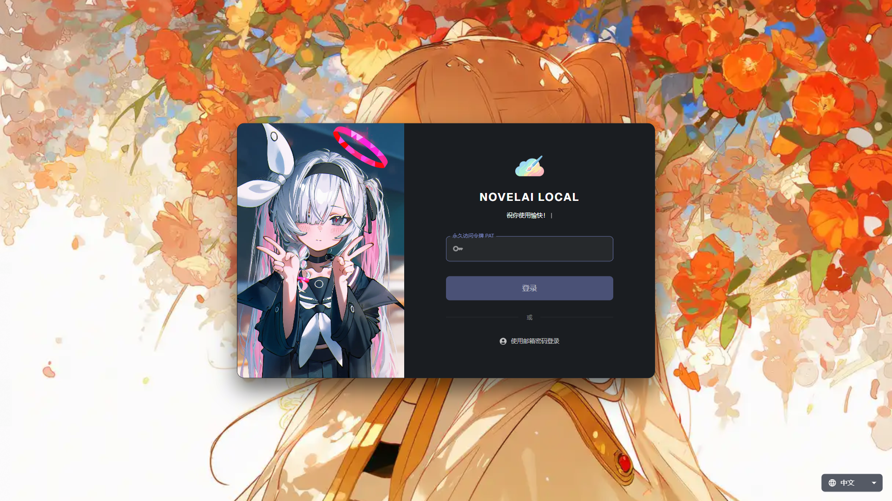
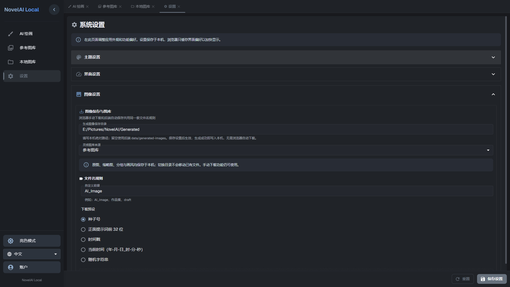
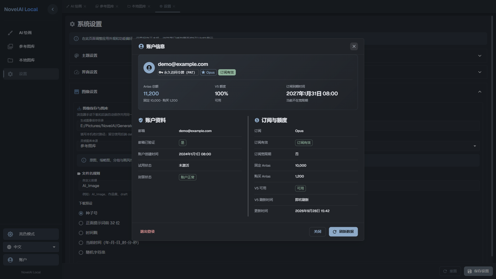

<p align="center">
  
</p>

<h1 align="center">NovelAI Local Web</h1>

<p align="center">在本机完成图像创作、参考整理与元数据编辑的 NovelAI 工作台</p>

<p align="center">
  <a href="https://nai.idlecloud.cc">在线网站</a> ·
  <a href="#界面与使用流程">界面预览</a> ·
  <a href="#快速开始">快速开始</a> ·
  <a href="#配置与数据">配置与数据</a> ·
  <a href="./LICENSE">AGPL-3.0 许可证</a>
</p>

NovelAI Local Web 是面向 Windows 个人用户的本地 Web 客户端。提示词、模型参数、角色控制、参考图片和生成结果集中在一个响应式工作台中；图片与创作资料保存在自己的电脑上。

前端使用 Next.js / React / MUI，后端使用 Flask / Waitress。构建后的页面与 `/api` 由同一个本地服务提供，默认地址为 `http://127.0.0.1:5000`；登录、账户查询和图像生成通过后端访问 NovelAI 官方服务。

本项目为非官方社区项目，与 NovelAI / Anlatan 无隶属关系。需要自行准备可用的 NovelAI 账户；账户权限和实际费用以官方返回为准。服务仅支持本机 loopback 访问。

## 功能概览

| 功能 | 可以做什么 |
| --- | --- |
| 图像创作 | 文生图、图生图、局部重绘、连续生成、Upscale 与 Augment |
| 模型与角色 | V3 / Furry V3、V4、V4.5、V5 系列，角色提示词与位置控制，以及模型支持的 Vibe / Director 工具 |
| 提示词 | 正负提示词编辑、标签建议、V4 / V5 Tokenizer、随机提示词和提示词笔记 |
| 参考图库 | 拖入或多图上传，读取每张图的元数据，保存画风片段，建立个人参考集合 |
| 本地图库 | 浏览生成保存目录，分页瀑布流、搜索、虚拟分组、批量选择和可恢复的回收站 |
| 元数据处理 | 分层查看和编辑 PNG、EXIF、隐写内容；批量选图作为模板，编辑或清除后另存 PNG |
| 账户与界面 | 官方账户、订阅、Anlas 与 V5 额度；中英文、亮暗主题、主题色与背景设置 |

不同模型支持的参数有所区别，界面会按模型调整可用工具。参考图库与本地图库是两个独立入口，共用详情、分组与元数据编辑操作。

## 界面与使用流程

以下为 **1920 × 1080 的演示工作区截图**，使用项目自带示例图片搭建，不涉及真实账户，也不表示截图中的图片是本次实际生成的结果。

### 1. 创作工作台

左侧浏览图库与灵感图片，右侧编写正负提示词并配置模型、画布和角色，右侧底部集中显示生成操作和账户消耗信息。灵感来源可在卡片或设置中切换为内置示例、参考图库或本地图库。



单张生成保留手动填写的 Seed，留空时使用随机值。连续生成支持 1–8 张，逐张显示结果，相邻请求间隔 15 秒；取消会阻止后续请求，异常时停止且不会自动重试。连续生成每张使用新的 Seed，需要复现时请选择单张。

成功的生成结果由后端自动保存到输出目录。刷新或关闭页面不会删除已保存的文件，手动下载入口仍可使用。

### 2. 参考图库与本地图库

**参考图库**用于收藏外部参考。拖入图片或一次上传多张即可导入，标题和提示词无需预先填写；有元数据时自动提取，没有时可在详情中补充。



**本地图库**读取设置中的生成输出目录。使用缩略图瀑布流浏览结果，可搜索、选择多张、移动分组或放入回收站。分组只整理图库记录，不移动原图；删除会把文件移入应用专用回收站，可恢复到原位置，遇到同名文件时会提示冲突而不覆盖。



### 3. 图片详情：分别应用提示词、画风和参数

大图旁按卡片展示图片信息、主提示词、画风、角色与生成参数。长文本可滚动阅读，其他嵌套字段可逐层展开。

- **应用正向 / 应用负向**：只替换对应方向的提示词，保留另一方向和当前参数。
- **仅应用提示词**：同时应用正负提示词。
- **应用画风**：将保存的画风片段追加到当前正向提示词，也可单独复制画风。
- **应用全部参数**：回填图片中可识别的生成设置与角色信息。
- **保存为画风**：在主正向或角色正向提示词中选择文字，在底部确认区查看选段并保存；手机可长按选词。



“编辑信息”修改图库记录；需要将参数写入图片文件时，点击图片信息卡片中的 **编辑元数据**。

### 4. 可视化元数据与批量模板

元数据编辑以表单展示主正负提示词、每个角色的提示词与坐标，以及其他生成参数。PNG 文本、EXIF、alpha / RGB 隐写中的已识别重复字段合并编辑，同一角色按索引分别对应；未知对象、数组、布尔值和空值仍可展开、修改或增删，无需手写 JSON。



批量选图后点击 **编辑元数据**，可选择两种方式：

1. **不使用模板**：只覆盖本次改动的字段，每张图保留其余原值。
2. **选择已选图片作为模板**：通过缩略图和标题挑选一张，加载其完整元数据作为整批默认值，再继续编辑。模板替换元数据，不替换每张图片的图像内容。

也可以选择“清除后另存”，移除文本、EXIF 和支持的隐写元数据。编辑、清除与模板操作都创建新文件，原始图片保留。

### 5. 另存到指定目录

填写本机绝对路径，或通过 **浏览目录** 选择磁盘、进入子目录和返回上一级。默认建议位置是 `nai_flask/data/metadata-exports`；目录尚不存在时，会在保存时创建。



副本只写入所选目录，不额外复制到生成图库，也不覆盖已有文件。若主动选择了生成输出目录，新文件会在图库扫描时显示。

<details>
<summary><strong>登录、账户与个性化设置</strong></summary>

登录支持 **Persistent Token** 和 **邮箱密码**。若官方要求额外验证码，请改用 Persistent Token。



设置页可调整语言、亮暗主题、主题色、背景和动画；**生成图片保存目录**决定自动保存与本地图库读取的位置，**灵感来源**决定工作台使用哪一组图片。这与元数据另存时单独选择的目录相互独立。



账户页集中显示登录方式、订阅状态、固定与购买 Anlas、V5 额度，并可手动刷新。通过邮箱密码登录时，还可按页面提示管理账户凭据；修改前请先在官方页面备份重要内容。



</details>

## 快速开始

需要 Windows 10 / 11、Python **3.11+**（含 `py` Launcher）、Node.js **20+**（含 npm），以及可访问 NovelAI 官方服务的网络。

```powershell
git clone https://github.com/YILING0013/novelai_local_web.git
cd novelai_local_web
.\setup.bat
.\start.bat
```

也可下载源码压缩包解压，先双击 `setup.bat`，完成后双击 `start.bat`。

- `setup.bat` 创建 `nai_flask/.venv`、安装后端和前端依赖，并构建静态页面到 `next_nai_web/out`。
- `start.bat` 启动本地服务，就绪后自动打开 <http://127.0.0.1:5000/login>。保持启动窗口开启，按 `Ctrl+C` 或关闭该窗口停止服务。
- 启动器会复用当前项目已运行的健康服务；其他程序占用端口时会报错，不会自动换端口。
- 更新源码时，先停止旧服务，重新运行 `setup.bat`，完成后再运行 `start.bat`。

## 配置与数据

### 服务配置

默认配置可直接使用。需要修改端口、数据位置或请求超时时，在项目根目录执行：

```powershell
Copy-Item .\nai_flask\config.example.json .\nai_flask\config.local.json
```

编辑 `nai_flask/config.local.json`：

```json
{
  "port": 5000,
  "data_dir": "data",
  "upstream_timeout_seconds": 120
}
```

`data_dir` 的相对路径以 `nai_flask` 为基准，也可填写绝对路径，例如 `E:/NovelAIData`。配置修改后重启后端；不要在此文件中保存账户凭据。

### 图片目录与工作区

| 位置或设置 | 用途 |
| --- | --- |
| `data/reference-images/` | 参考图库导入的图片 |
| `data/generated-images/` | 默认生成输出目录；设置中的 `outputDirectory` 可改为本机绝对路径 |
| `data/metadata-exports/` | 元数据另存的默认建议目录，每次另存也可另选位置 |
| `data/image-library.db` | 图库索引、提示词、画风、虚拟分组和迁移记录 |
| `data/gallery-thumbnails/` | 图库缩略图缓存 |
| `data/settings.json` | 界面偏好、输出目录与灵感来源 |
| `data/notes.json`、`data/random-prompts.json` | 提示词笔记和随机提示词资料 |
| 浏览器存储 | 提示词草稿、部分界面偏好和 Vibe 缓存 |

表中 `data` 默认指 `nai_flask/data`，随 `data_dir` 调整；自定义生成目录和另存目录可位于它之外。设置中的 `inspirationSource` 分别使用 `default`（内置）、`references`（参考）、`outputs`（本地生成）三种来源。

不同官方账户共享同一个本地工作区。退出、换号或刷新页面不会删除资料。备份时先停止服务，再复制完整数据目录、自定义生成目录和需要保留的另存目录；浏览器草稿不包含在后端数据目录中。

<details>
<summary><strong>旧数据迁移与凭据处理</strong></summary>

旧画师串、图片参考库会迁入参考图库，保留源数据库和图片；多图条目整理为分组，无图记录转入提示词笔记。迁移可在中断后继续，完成后不会重复导入。缺失的数据目录会自动建立，仍在生成目录中的图片可重新扫描，但不会恢复已经从磁盘删除的文件或丢失的分组。

Persistent Token、密码及官方访问凭据保留在后端进程内存中，不写入工作区文件。浏览器使用本机会话 Cookie；本地接口执行会话、来源与 CSRF 校验。服务重启后需要重新登录。不要向 Issue、截图或日志附件中放入真实凭据。

</details>

## 开发与测试

项目主要目录为 `next_nai_web/`（前端）、`nai_flask/`（后端）和 `scripts/`（启动与发布检查）。先运行一次 `setup.bat` 准备依赖。

从项目根目录进入后端，运行测试后返回：

```powershell
cd nai_flask
.\.venv\Scripts\python.exe -m pytest
cd ..
```

在前端目录运行测试、静态检查和构建：

```powershell
cd next_nai_web
npm test
npm run lint
npm run build
cd ..
```

在项目根目录检查发布边界：

```powershell
.\nai_flask\.venv\Scripts\python.exe .\scripts\verify_release.py
```

自动化测试使用模拟官方接口，不需要真实 NovelAI 凭据。修改前端后需重新构建静态产物；仅重启后端不会更新旧页面。

<details>
<summary><strong>常见问题与日志</strong></summary>

| 情况 | 处理方式 |
| --- | --- |
| 找不到 Python / Node.js | 检查 `py -3 --version`、`node --version`、`npm --version` |
| 5000 端口被占用 | 用 `Get-NetTCPConnection -State Listen -LocalPort 5000` 确认进程，再停止对应旧服务或明确调整配置 |
| 安装或构建失败 | 查看窗口中的首个错误，确认依赖下载与网络后重试 |
| Token 返回 401 / 登录要求验证码 | 在官方页面核对 Token；验证码场景改用 Persistent Token |
| 生成参数报错 | 核对模型与参考图、Vibe、角色等工具是否兼容 |
| 保存目录不可用 | 检查绝对路径和当前 Windows 用户的写入权限 |
| 本地 JSON 损坏 | 保留损坏文件，检查同目录备份文件后再恢复 |

运行日志在启动窗口中。反馈时提供操作步骤、错误码和 correlation ID，避免附带 Token、密码或完整账户响应。临时调试可先在 PowerShell 中设置 `$env:NOVELAI_LOCAL_LOG_LEVEL = 'DEBUG'`，再运行 `start.bat`。

</details>

## 许可证

本项目按 [GNU Affero General Public License v3.0](./LICENSE) 发布。使用 NovelAI 服务时请遵守其[服务条款](https://novelai.net/terms)，并自行负责账户安全、生成内容与费用。
